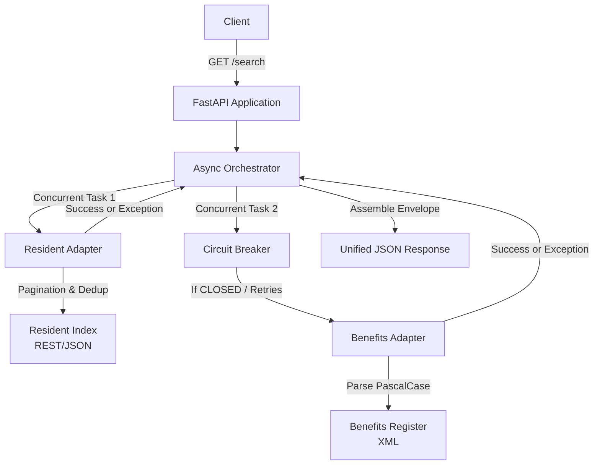

# No Wrong Door — Unified Resident API

> Brite Spark 2026 · Problem 3

A single, resilient API that aggregates the Calder County **Resident Index** (REST/JSON)
and **Benefits Register** (XML) into one unified view.

---

## Table of Contents

1. [Problem Statement](#problem-statement)
2. [Solution Overview](#solution-overview)
3. [Functional Capabilities](#functional-capabilities)
4. [System Architecture](#system-architecture)
5. [Technical Stack](#technical-stack)
6. [Quick Start](#quick-start)
7. [CLI Commands Reference](#cli-commands-reference)
8. [Failure & Edge Case Handling](#failure--edge-case-handling)
9. [Day-2 Challenge](#day-2-challenge)
10. [API Response Examples](#api-response-examples)
11. [Test Suite](#test-suite)
12. [Configuration](#configuration)
13. [Project Structure](#project-structure)

---

## Problem Statement

The Brite Spark 2026 Problem 3 ("No Wrong Door") challenges participants to build a resilient integration layer over two fundamentally heterogeneous government datasets:
- **Resident Index**: A paginated REST/JSON service.
- **Benefits Register**: A legacy XML service.

The primary engineering challenge is to construct a single, unified search API that reliably aggregates records across both systems. Crucially, the system must survive a **Day-2 requirement** where the Benefits Register permanently degrades to an approximately 40% failure rate, without allowing the failing upstream dependency to compromise the availability of the overall integration.

---

## Solution Overview

We engineered an asynchronous, fault-isolated FastAPI orchestrator. 

When a user performs a search, the API concurrently dispatches requests to both upstream services. 
- The REST adapter handles automated pagination and deterministic deduplication. 
- The XML adapter implements bounded retries and linear backoff to invisibly absorb transient failures.
- A centralized Circuit Breaker protects the system from stalling during sustained XML outages.

If a source fails completely, the API intercepts the exception, preserves failure isolation, and returns a graceful degradation envelope containing the intact data from the healthy source alongside explicit `unavailable` status metadata.

---

## Functional Capabilities

| Capability | Implementation / Behaviour |
|:--|:--|
| **Unified resident search** | A single `GET /search` endpoint aggregates both data sources concurrently. |
| **REST pagination** | Automatically traverses all available pages from the Resident Index. |
| **Resident deduplication** | Safely filters 661 raw fetched REST records down to exactly 620 unique residents in-memory. |
| **XML parsing** | Correctly parses legacy PascalCase XML into standardized Pydantic models. |
| **Concurrent upstream calls** | Uses `asyncio.gather(return_exceptions=True)` to prevent one dead source from crashing the other. |
| **Bounded retries** | Exactly 3 total attempts for the Benefits Register per request. |
| **Linear backoff** | Multiplier-based backoff (`0.3s * attempt`) between retries to avoid overwhelming struggling services. |
| **Graceful degradation** | Returns intact data from the healthy source instead of a bare HTTP 500 when the other fails. |
| **Circuit breaker** | An in-memory state machine (`CLOSED` → `OPEN` → `HALF_OPEN`) fails-fast during sustained outages. |
| **Application logging** | Emits structured standard logs detailing retries, circuit transitions, and HTTP timeouts. |
| **Configuration validation** | Validates `app/config.py` environment variables at startup to prevent invalid timeouts/thresholds. |
| **Stable API response envelope** | Every response consistently separates `resident_index_matches` and `benefits_register_matches` alongside an explicit `sources` metadata block. |

---

## System Architecture



---

## Technical Stack

| Technology | Purpose |
|:--|:--|
| **Python 3.10+** | Core runtime environment. |
| **FastAPI** | High-performance API framework with native async support. |
| **Pydantic** | Strict data validation and schema serialization. |
| **httpx** | Async-native, non-blocking HTTP client for concurrent requests. |
| **asyncio** | Core standard-library concurrency mechanism. |
| **Uvicorn** | ASGI production web server. |
| **pytest & pytest-asyncio** | Automated test suite execution. |
| **Python standard logging** | Production-grade structured observability. |
| **Environment variables** | Configuration management (`os` module). |

---

## Quick Start

### 1. Clone and enter the project

```bash
git clone https://github.com/Lokesh-g07/brite-spark-2026-no-wrong-door.git
cd brite
```

### 2. Create a virtual environment and install dependencies

```bash
python -m venv .venv

# Windows (PowerShell)
.\.venv\Scripts\Activate.ps1

# Windows (cmd)
.\.venv\Scripts\activate.bat

# macOS / Linux
source .venv/bin/activate

pip install -r requirements.txt
```

### 3. Start the mock upstream services

Open a **separate terminal** (activate the venv there too if needed):

```bash
# Terminal 2 — Resident Index (REST, port 8081)
python services/rest_service.py --port 8081

# Terminal 3 — Benefits Register (XML, port 8082)
python services/xml_service.py --port 8082
```

Or on macOS / Linux in one terminal:

```bash
bash services/run_both.sh
```

### 4. Start the unified API

```bash
python -m uvicorn app.main:app --host 127.0.0.1 --port 8000 --reload
```

### 5. Verify it works

#### Liveness Health Check
```bash
curl http://127.0.0.1:8000/health
```

Expected response:
```json
{"status": "healthy", "service": "no-wrong-door"}
```

#### Unified Resident Search
Search for a resident across both systems with a single call:

```bash
curl "http://127.0.0.1:8000/search?last_name=Delgado"
```

Interactive OpenAPI documentation is available at: http://127.0.0.1:8000/docs

---

## CLI Commands Reference

| Command | Purpose |
|:--|:--|
| `python -m venv .venv` | Create virtual environment |
| `.\.venv\Scripts\activate` | Activate virtual environment (Windows) |
| `pip install -r requirements.txt` | Install dependencies |
| `python -m uvicorn app.main:app --host 127.0.0.1 --port 8000` | Start FastAPI application (Terminal 1) |
| `python services/rest_service.py --port 8081` | Start Resident Index mock service (Terminal 2) |
| `python services/xml_service.py --port 8082` | Start Benefits Register mock service (Terminal 3) |
| `python services/xml_service.py --port 8082 --failure-rate 0.40` | Start Benefits Register with **Day-2 40% failure rate** |
| `curl http://127.0.0.1:8000/health` | Test Liveness health endpoint |
| `curl "http://127.0.0.1:8000/search?last_name=Delgado"` | Test Unified Resident Search |
| `python -m pytest tests/ -v` | Run full 23-test suite |
| `python -m pytest tests/test_circuit_breaker.py -v` | Run specific circuit breaker tests |

---

## Failure & Edge Case Handling

The API guarantees **graceful degradation** instead of returning bare HTTP 500s. 

| Scenario | Actual System Behaviour |
|:--|:--|
| **Resident Index unavailable** | API returns HTTP 200 containing intact Benefits data. `sources.resident_index` reports `status: "unavailable"` and the exact connection/HTTP error. |
| **Benefits Register transient failure** | Caught by bounded linear backoff. API retries invisibly. `attempts` in the response envelope will reflect the retry count (>1). |
| **XML retry exhaustion** | After exactly 3 failed attempts, the API degrades gracefully. It returns intact Resident data, with `sources.benefits_register.status` set to `"unavailable"` and `attempts: 3`. |
| **Benefits Circuit Breaker OPEN** | Following sustained XML failures, the circuit opens. Subsequent requests fail-fast instantly. Returns `status: "unavailable"`, `attempts: 0`, and `error: "Circuit breaker OPEN"`. |
| **HALF_OPEN recovery** | After the recovery duration (30s), 1 test request is permitted. If it succeeds, the circuit closes. If it fails, it instantly re-opens. |
| **Both upstreams unavailable** | API returns a clean HTTP 200 with empty data arrays and explicitly marks both sources as `"unavailable"` with complete error logs. |
| **Partial source failure** | A failure in one source is caught by `return_exceptions=True` and never cancels or crashes the data processing of the healthy source. |

---

## Day-2 Challenge

**Day 1:** Normal upstream operation with occasional latency.
**Day 2:** The Benefits Register permanently operates at an approximately 40% failure rate.

The unified API manages this gracefully:
1. **Bounded retries:** A transient failure triggers up to 3 total attempts.
2. **Linear backoff:** Retries are spaced linearly (`0.3s * attempt`) to avoid hammering a struggling service.
3. **Failure isolation:** The Resident Index is queried concurrently and remains completely usable even when the Benefits Register is repeatedly failing.
4. **Graceful degradation:** Exhausted retries result in a partial success response (`resident_index_matches` intact, `benefits_register_matches` empty) rather than a system crash.
5. **Circuit Breaker:** If the 40% failure rate clusters into a sustained total outage, the Circuit Breaker opens, failing fast to protect the caller from stalling in endless retry loops.

---

## API Response Examples

### GET /health
```json
{
  "status": "healthy",
  "service": "no-wrong-door"
}
```

### GET /search (Normal Success)
```json
{
  "data": {
    "query": {
      "first_name": null,
      "last_name": "Delgado",
      "date_of_birth": null
    },
    "resident_index_matches": [
      {
        "id": "R-10234",
        "first_name": "Maria",
        "last_name": "Delgado",
        "date_of_birth": "1971-04-02",
        "address_line": "118 Cedar Ave",
        "city": "Northgate",
        "phone": "555-402-9911",
        "program_status": "Active",
        "last_contact": "2025-11-30"
      }
    ],
    "benefits_register_matches": [
      {
        "ref": "NO/2019/4234",
        "name": "DELGADO, Maria",
        "born": "1971-04-02",
        "addr": "118 Cedar Avenue",
        "town": "Northgate",
        "benefit_code": "HSP-B",
        "review_due": "2026-05-14"
      }
    ]
  },
  "sources": {
    "resident_index": {
      "status": "ok",
      "records_fetched": 661,
      "duplicates_removed": 41,
      "error": null,
      "attempts": 1
    },
    "benefits_register": {
      "status": "ok",
      "records_fetched": 540,
      "duplicates_removed": null,
      "error": null,
      "attempts": 1
    }
  }
}
```

### GET /search (Graceful Degradation - XML Exhausted/OPEN)
```json
{
  "data": {
    "query": {
      "first_name": null,
      "last_name": "Delgado",
      "date_of_birth": null
    },
    "resident_index_matches": [
      {
        "id": "R-10234",
        "first_name": "Maria",
        "last_name": "Delgado",
        "date_of_birth": "1971-04-02",
        "address_line": "118 Cedar Ave",
        "city": "Northgate",
        "phone": "555-402-9911",
        "program_status": "Active",
        "last_contact": "2025-11-30"
      }
    ],
    "benefits_register_matches": []
  },
  "sources": {
    "resident_index": {
      "status": "ok",
      "records_fetched": 661,
      "duplicates_removed": 41,
      "error": null,
      "attempts": 1
    },
    "benefits_register": {
      "status": "unavailable",
      "records_fetched": 0,
      "duplicates_removed": null,
      "error": "Circuit breaker OPEN: Rejecting request to XML service.",
      "attempts": 0
    }
  }
}
```

---

## Test Suite

The project enforces reliability via **23 automated tests**.

| Test File | Coverage |
|:--|:--|
| `test_health.py` | Liveness endpoint HTTP 200 responses and healthy contract validation. |
| `test_circuit_breaker.py` | Unit and integration validation of exact state transitions (`CLOSED` → `OPEN` → `HALF_OPEN`), fast-fail enforcement, and retry threshold limits. |
| `test_orchestrator.py` | End-to-end integration proving concurrent data assembly, pagination, deterministic deduplication filtering, PascalCase parsing, and guaranteed graceful degradation under single or dual failure modes. |
| `test_config.py` | Startup validation ensuring environment variables strictly reject negative timeouts or invalid attempt boundaries. |

---

## Configuration

All configuration is centralized in `app/config.py` and strictly validated at startup.

| Variable | Default | Purpose |
|:--|:--|:--|
| `REST_BASE_URL` | `http://127.0.0.1:8081` | Resident Index base URL |
| `XML_BASE_URL` | `http://127.0.0.1:8082` | Benefits Register base URL |
| `XML_MAX_ATTEMPTS` | `3` | Total attempts (1 initial + 2 retries) for XML calls |
| `XML_TIMEOUT` | `5.0` | Seconds per XML attempt |
| `XML_BACKOFF_BASE` | `0.3` | Backoff multiplier between XML retries (`0.3s * attempt`) |
| `REST_TIMEOUT` | `10.0` | Seconds for REST calls |
| `CB_FAILURE_THRESHOLD` | `3` | Consecutive failures before the circuit opens |
| `CB_RECOVERY_DURATION` | `30.0` | Seconds the circuit stays OPEN before allowing a HALF_OPEN trial |
| `DEFAULT_PAGE_SIZE` | `50` | Default page size for API endpoints |

---

## Project Structure

```
brite/
├── README.md
├── ARCHITECTURE.md
├── DECISIONS.md
├── PROJECT_ANALYSIS.md
├── AI-USAGE.md
├── requirements.txt
├── .gitignore
│
├── services/              # Provided mock services (unmodified)
│   ├── rest_service.py
│   ├── xml_service.py
│   ├── _rest_data.json
│   ├── _xml_data.json
│   └── run_both.sh
│
├── app/                   # Application code
│   ├── __init__.py
│   ├── main.py            # FastAPI app + structured logging
│   ├── config.py          # Centralised config + startup validation
│   ├── circuit_breaker.py # Singleton in-memory circuit breaker
│   ├── api/
│   │   ├── __init__.py
│   │   └── routes.py      # /search and /health API endpoints
│   ├── adapters/
│   │   ├── __init__.py
│   │   ├── resident_adapter.py   # REST pagination & deduplication
│   │   └── benefits_adapter.py   # XML parsing, retries & circuit integration
│   ├── models/
│   │   ├── __init__.py
│   │   └── models.py      # Pydantic schemas & response envelopes
│   └── services/
│       ├── __init__.py
│       └── orchestrator.py# Concurrent aggregation, search & failure isolation
│
└── tests/
    ├── __init__.py
    ├── test_health.py           # Health endpoint verification
    ├── test_orchestrator.py     # Parsing, degradation, retry, dedup & search tests
    ├── test_circuit_breaker.py  # Unit and integration tests for state transitions
    └── test_config.py           # Configuration validation tests
```
